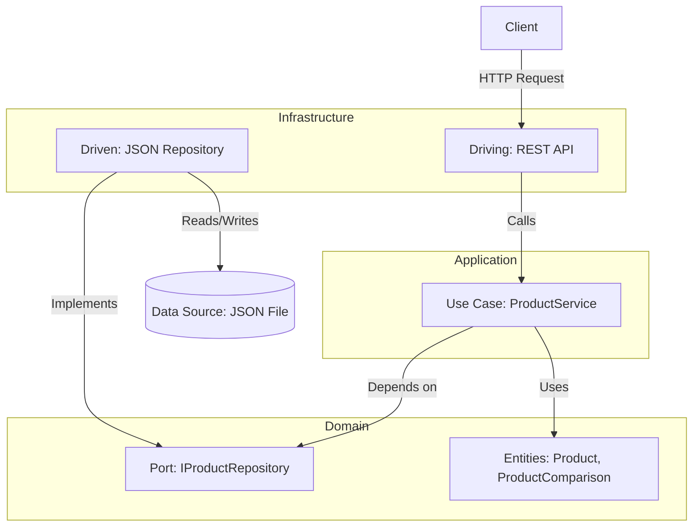

<div align="center">
  <h1 align="center">Product Comparison REST API</h1>
  <p align="center">
    A robust RESTful API built with Node.js, Express, and TypeScript, following the principles of Hexagonal Architecture.
  </p>
  
  <p align="center">
    
    
    <a href="https://github.com/andres11152/API-Rest-Hexagonal-Arquitecture-Test/actions/workflows/ci.yml"></a>
    
    
    
    
  </p>
</div>

---

## Table of Contents

1.  [ Project Description](#-project-description)
2.  [✨ Features](#-features)
3.  [🏛️ Architecture and Design Decisions](#-architecture-and-design-decisions)
4.  [📂 Folder Structure](#-folder-structure)
5.  [🛠️ Tech Stack](#-tech-stack)
6.  [🏁 Installation and Setup](#-installation-and-setup)
7.  [📦 Configuration](#-configuration)
8.  [✅ Code Quality](#-code-quality)
9.  [🧪 Testing](#-testing)
10. [🔄 Continuous Integration (CI/CD)](#-continuous-integration-cicd)
11. [📖 API Reference](#-api-reference)

---

## 🚀 Project Description

This project implements a REST API for querying and comparing products. It is designed as a modern backend showcase, applying advanced software design patterns like **Hexagonal Architecture (Ports & Adapters)** and **SOLID** principles. The goal is to create a decoupled, scalable, maintainable, and highly testable codebase.

## ✨ Features

- **Product Listing:** Get a complete list of available products.
- **Product Detail:** Query detailed information for a product by its ID.
- **Product Comparison:** Compare two products and receive a detailed summary of their features and differences.

## 🏛️ Architecture and Design Decisions

The application's architecture is a deliberate choice to demonstrate a robust, decoupled, and highly testable software foundation, ideal for enterprise environments.

### Hexagonal Architecture (Ports & Adapters)

A strict separation has been implemented between the application's core (domain and business logic) and the infrastructure details (web framework, database). This allows the business logic to be independent of external technology, facilitating its evolution and testing.

- **`domain` (The Core):** Contains the **Rich Domain Entities** (classes like `Product` and `ProductComparison` that encapsulate data and logic), domain-specific exceptions, and "ports" (interfaces like `IProductRepository`). This layer is pure, technology-agnostic, and has no external dependencies.
- **`application` (Business Logic):** Contains the use cases (`ProductService`) that orchestrate the business logic. It depends solely on the domain's abstractions (ports).
- **`infrastructure` (The Outside World):** Contains the "adapters" that implement the ports and interact with the outside world.
  - **Driving Adapters:** Initiate interaction, such as the REST API (Express controllers, routes).
  - **Driven Adapters:** Are controlled by the application, such as the repository implementation (`JsonProductRepository`) that connects to the data source.



### SOLID Principles
The design respects SOLID principles, with a strong emphasis on the **Dependency Inversion Principle (DIP)**. High-level layers (application) do not depend on low-level layers (infrastructure), but rather on abstractions (domain interfaces). This is achieved through **Dependency Injection**, manually configured in `server.ts` to keep the example explicit and simple.

### Key Design Decisions
- **Tactical Persistence:** For this proof of concept, a repository reading from a `products.json` file was implemented. This simplifies setup and execution. Thanks to the architecture, migrating to **PostgreSQL** or **MongoDB** would only require creating a new repository implementing `IProductRepository` and changing one line in the dependency injection config, without touching the business logic.
- **Centralized Error Handling:** An Express middleware captures custom domain exceptions (e.g., `ProductNotFoundException`) and translates them into appropriate HTTP responses (e.g., `404 Not Found`), keeping controllers clean.
- **Input Validation:** `express-validator` is used in middlewares to validate input data at the route level, delegating this responsibility and keeping controllers focused on their main task.

## 📂 Folder Structure
The `src` directory structure is organized to clearly reflect the Hexagonal Architecture:

```
src/
├── application/
│   └── services/
│       └── product.service.ts       # Orchestrates use cases (application logic)
├── domain/
│   ├── entities/
│   │   ├── product.entity.ts        # Rich Domain Entity for Product
│   │   └── product-comparison.entity.ts # Rich Domain Entity for Comparison
│   ├── exceptions/
│   │   └── product-not-found.exception.ts # Domain-specific exceptions
│   └── repositories/
│       └── product-repository.interface.ts # Repository Port (Contract)
├── infrastructure/
│   ├── driven-adapters/             # Adapters controlled by the application
│   │   └── json-repository/
│   │       └── json-product.repository.ts # Adapter implementing the port
│   └── driving-adapters/            # Adapters that control the application
│       └── api-rest/
│           ├── controllers/
│           ├── mappers/
│           ├── middlewares/
│           └── routes/
├── data/
│   └── products.json                # Data source (Infrastructure detail)
├── app.ts                           # Express and middleware configuration
└── server.ts                        # Entry point, Dependency Injection, and server start
```

## 🛠️ Tech Stack
- **Language:** TypeScript
- **Backend:** Node.js, Express.js
- **Testing:** Jest, Supertest
- **Validation:** `express-validator`
- **Code Quality:** ESLint, Prettier

## 🏁 Installation and Setup
Ensure you have Node.js (v16 or higher) and npm installed.

1.  **Clone the repository:**
    ```bash
    git clone https://github.com/andres11152/API-Rest-Hexagonal-Arquitecture-Test
    cd API-Rest-Hexagonal-Arquitecture-Test
    ```

2.  **Install dependencies:**
    ```bash
    npm install
    ```

3.  **Run in development mode:** The server will start at `http://localhost:8080` and automatically reload on changes.
    ```bash
    npm run dev
    ```

4.  **Build for production:** This compiles the TypeScript code to JavaScript in the `dist/` directory.
    ```bash
    npm run build
    ```

5.  **Run in production mode:** Runs the application from the compiled code.
    ```bash
    npm start
    ```

## 📦 Configuration
The project can be configured via environment variables. You can create a `.env` file in the project root.

```env
# Port on which the server will run
PORT=8080
```

## ✅ Code Quality
ESLint and Prettier are used to maintain a clean and consistent code style. To check and format the code, you can use the following commands:

```bash
# Run the linter to find style errors
npm run lint

# Automatically format the code
npm run format
```

## 🧪 Testing
The project includes unit and integration tests to ensure the quality and correct functioning of the business logic and endpoints.

To run all tests:

```bash
npm test
```

## 📖 API Reference

### GET /products
Returns a list of all available products.

**Success Response (`200 OK`):**
```json
[
  {
    "id": "1",
    "name": "Laptop Pro X",
    "price": 999900,
    "rating": 4.8,
    "image": "https://example.com/images/laptop_pro_x.jpg",
    "description": "A high-performance laptop for creative professionals and developers. Power and portability in an elegant design.",
    "specs": {
      "screen": "15.6 inch, 4K UHD",
      "processor": "Intel Core i9, 12th Gen 2",
      "ram": "32GB DDR5",
      "storage": "1TB NVMe SSD",
      "graphics": "NVIDIA GeForce RTX 4070"
    },
    "currency": "COP",
    "category": "General"
  }
]
```

### GET /products/{id}
Returns a specific product by its ID.

**URL Parameters:**
- `id` (string, required): The ID of the product.

**Success Response (`200 OK`):** A product object (similar to the listing).

**Error Responses:**
- `400 Bad Request`: If the provided ID is invalid.
- `404 Not Found`: If no product is found with the specified ID.

### GET /products/compare
Compares two products and returns a detailed summary of their differences.

**Query Params:**
- `id1` (string, required): ID of the first product.
- `id2` (string, required): ID of the second product.

**Success Response (`200 OK`):**
```json
{
  "product1": {
    "id": "1",
    "name": "Laptop Pro X",
    "price": 999900,
    "rating": 4.8,
    "image": "https://example.com/images/laptop_pro_x.jpg",
    "description": "A high-performance laptop for creative professionals and developers. Power and portability in an elegant design.",
    "specs": {
      "screen": "15.6 inch, 4K UHD",
      "processor": "Intel Core i9, 12th Gen 2",
      "ram": "32GB DDR5",
      "storage": "1TB NVMe SSD",
      "graphics": "NVIDIA GeForce RTX 4070"
    },
    "currency": "COP",
    "category": "General"
  },
  "product2": {
    "id": "2",
    "name": "Smartphone Galaxy S25",
    "price": 899900,
    "rating": 4.7,
    "image": "https://example.com/images/galaxy_s25.jpg",
    "description": "The latest smartphone with a revolutionary camera and an immersive display. 5G connectivity and unparalleled performance.",
    "specs": {
      "screen": "6.8 inch, Dynamic AMOLED 2X",
      "processor": "Snapdragon 8 Gen 4",
      "ram": "12GB",
      "storage": "256GB UFS 4.0",
      "camera": "200MP Wide, 12MP Ultrawide, 10MP Telephoto"
    },
    "currency": "COP",
    "category": "General"
  },
  "comparison": {
    "priceDifference": 100000,
    "ratingDifference": 0.1,
    "common_specs": [
      "ram"
    ],
    "unique_specs_product1": {
      "screen": "15.6 inch, 4K UHD",
      "processor": "Intel Core i9, 12th Gen 2",
      "ram": "32GB DDR5",
      "storage": "1TB NVMe SSD",
      "graphics": "NVIDIA GeForce RTX 4070"
    },
    "unique_specs_product2": {
      "screen": "6.8 inch, Dynamic AMOLED 2X",
      "processor": "Snapdragon 8 Gen 4",
      "ram": "12GB",
      "storage": "256GB UFS 4.0",
      "camera": "200MP Wide, 12MP Ultrawide, 10MP Telephoto"
    }
  }
}
```

**Error Responses:**
- `400 Bad Request`: If `id1` or `id2` are missing from the query or are invalid.
- `404 Not Found`: If either of the products is not found.